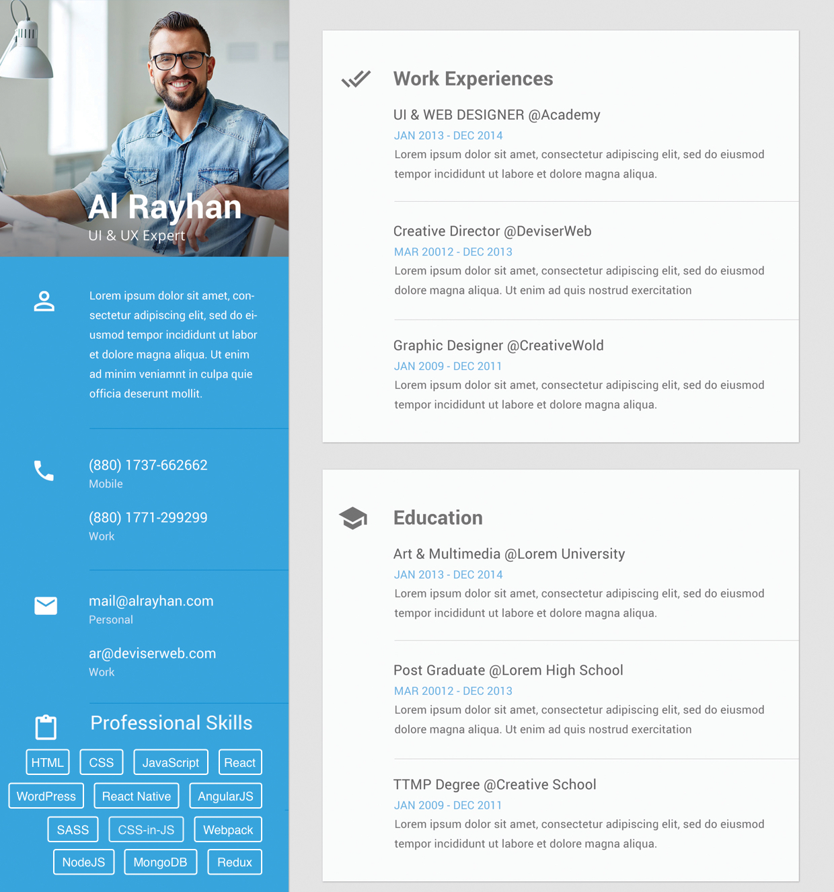

# Awesome CV Template

_Um template de CV responsivo feito com CSS, HTML e JS._

### Rodar localmente

1 - Baixe ou clone o repositório:
`git clone git@github.com:SergioJrDev/awesome-cv-template.git`

2 - Instale o SASS, como única dependência:
`npm i`
ou
`yarn`

3 - Para compilar as alteracões nos aquivos .scss, execute no terminal:
`npm run css` ou `yarn run css`
Ou para assistir as alteracões
`npm run css-watch` ou `yarn run css-watch`

### Customizacão

Esse projeto utiliza apenas HTML, CSS e JS puro. Para alterar o conteúdo, use o arquivo `index.html`. Para alterar o estilo, use a pasta `src/styles`. Existem várias classes genéricas que podem ser utilizadas. Verifique os arquivos `colors.scss`, `typography.scss`, `globals.scss` dentro de styles. Para mudar as cores, veja o arquivo `variables.scss`.

### Roadmap

Algumas funcionalidades que gostaria de implementar estão aqui. Sinta-se a vontade para sugerir outras a partir de uma issue ou me ajudar a implementa-las.

### Contribuicão

Caso você queira sugerir ou mudar qualquer coisa, siga os seguintes passos:

1 - Abra uma issue descrevendo sua alteracão ou melhoria.

2 - Crie um fork desse projeto, faca suas alteracões e abra um pull request.
